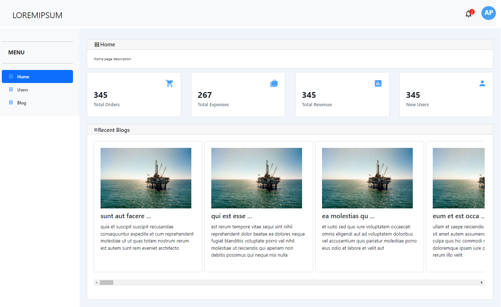
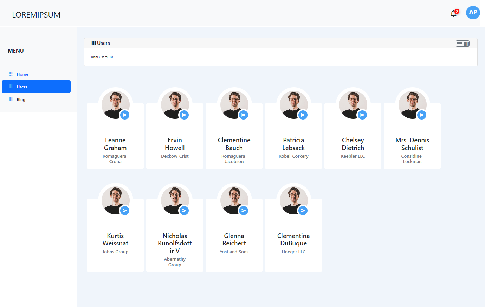
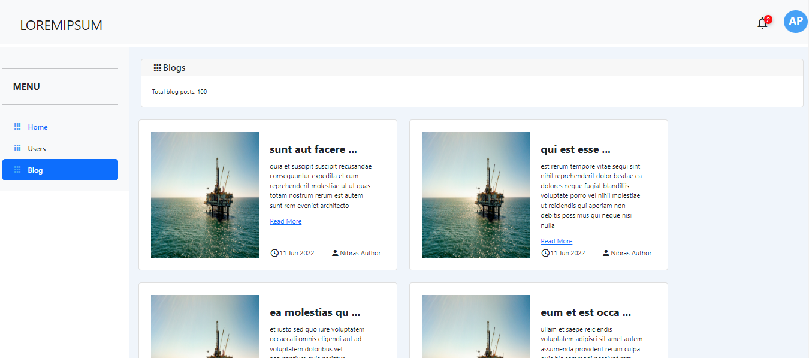
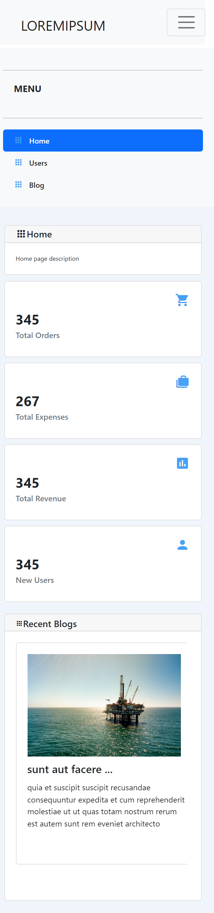

# Nibras-webapp-3 Interview Assignment

**Frameworks and libraries are used**  
- Angular version 14  
- Angular Material UI components  
- Bootstrap 5.1
- Google Material Icons  

1. im used Angular 14 version locally .pleace clone this repo and run the following comands  
**npm i**   
this will installl angular 14 version locally

2. After the  successfull installation of Angular 14 go to **Nibras-webapp-3** folder and again intall the node packages  
**npm i**

3. After the successfull intallation type  
**npm run start**

4. if all are success the application should run following url   
**[http://localhost:4200](http://localhost:4200/)**

# Screenshots - Web View
**Home page**  

**User page - Grid view**  

**User page - Table view**  

**Blog page**  

# Screenshots - Mobile View
**Home page**  

**User page**  
.png)

# Nibras-webapp-3 screen recording

